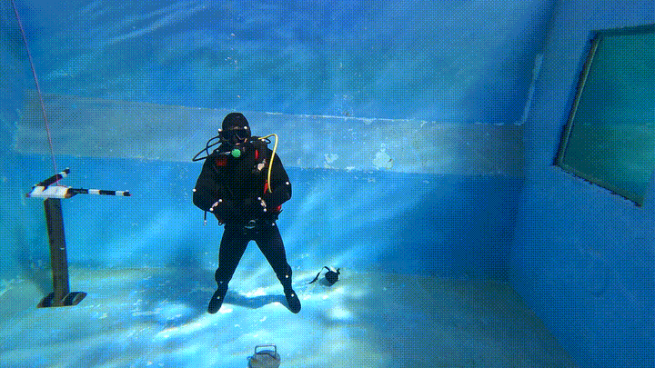
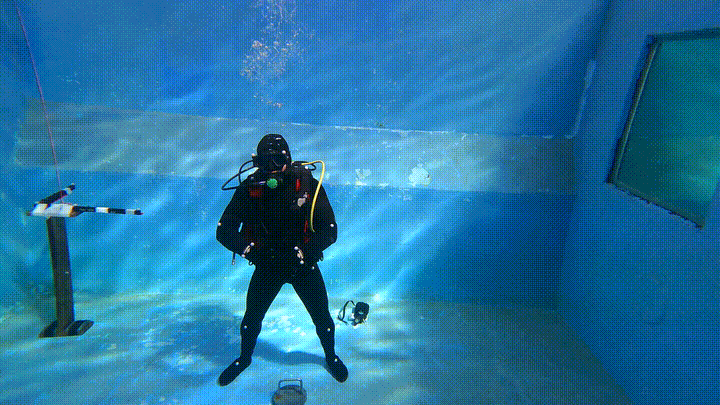

# DTW_KNN_RNN

This  github repository is associated with the paper :"Subject-independent diver gesture classification using upper limb movement" submitted to the journal Robotics and Automation Letter and currently under review.

  

This repository is organized as follows: 

+ ./data/ directory that contains the data used in the paper. 
 -- brut_data/ contains the extracted gestures with the gesture geometric features calculated as a pickle file. 
 -- subject3_mocap/ provide an example of raw mocap data in `.mat` format.
+ ./DTW-KNN/ include for the DTW classification.
 The DTW-KNN code is partially based on the code present in two following repositories:
 https://github.com/markdregan/K-Nearest-Neighbors-with-Dynamic-Time-Warping/
 https://github.com/kamperh/lecture_dtw_notebook 
+ ./RNN/ includes the RNN-based classification.

<!-- 
*out of air* -->

The 11 gestures classified in this paper :

    <!-- First Row: 3 GIFs -->
    <figure >
        
        <figcaption>out of air</figcaption>
    </figure>
    <figure >
        
        <figcaption>Assemble</figcaption>
    </figure>
    <figure >
        
        <figcaption>Cold</figcaption>
    </figure>
    <figure >
    <!-- Second Row: 3 GIFs -->
        
        <figcaption>Go down</figcaption>
    </figure>
    <figure >
        
        <figcaption>Go up</figcaption>
    </figure>
    <figure >
        
        <figcaption>Half-pressure</figcaption>
    </figure>
    <figure >
    <!-- Third Row: 3 GIFs -->
        
        <figcaption>Not well</figcaption>
    </figure>
    <figure >
        
        <figcaption>Ok</figcaption>
    </figure>
    <figure >
        
        <figcaption>Panting</figcaption>
    </figure>
    <!-- Fourth Row: 2 GIFs -->
    <figure >
        
        <figcaption>Reserve</figcaption>
    </figure>
    <figure >
        
        <figcaption>Stabilize</figcaption>
    </figure>

## Step 0 install the required files:
- Ensure you have Git installed on your machine. You can download it from [git-scm.com](https://git-scm.com/).
To clone our repository navigate to the directory where you want to clone the code using your terminal. 
`cd /path/to/your/directory/` 
Once in the desired directory clone the repository using the following command: 
`git clone git@github.com:LaboratoireCosmerTOULON/DTW_KNN_RNN.git`

The data of this project is made available on :  [Calculated angle features](https://app.box.com/index.php?rm=box_download_shared_file&shared_name=6ucmlmzk511liyc4ag1rmlut8thmkcnw&file_id=f_1606055674885) 
Once you download the zip file, extract the content into `/path/to/your/directory/data/extracted_features/` 
The data presented is preprocessed and contains the extracted feature data, organized by subject and formatted in pandas frame inside pickle files. 

If you are interested in raw data obtained using the Motion capture, we provide an example of this on : [Subject 3 MoCap data](https://app.box.com/index.php?rm=box_download_shared_file&shared_name=8hw714koz3sl5uxvkiokqka07r8vtmw7&file_id=f_1606058404172) 
The  data is presented in .mat file and can be visualized using MATLAB. This dataset is not required for this project.  

## Step 1 replicate the python environment
To replicate our python environment we provide the `requirments.txt` file in the `/env/` directory, the code is running on `python 3.8.16`
We recommend using  python environment mangers like conda or virtualenv to replicate the environment without interfering with your current python installation. 
In case you are unfamiliar with the process please check the corresponding  websites for your installation : 
 + conda : https://conda.io/projects/conda/en/latest/user-guide/install/index.html
 + virtualenv : https://virtualenv.pypa.io/en/latest/installation.html

we provided two bash script for environment installation with these two mangers. 
To replicate our enviroment in conda navigate to `/env/` using `cd  /path/to/your/directory/DTW_KNN_RNN/env/` 
For conda installation: 
`source ./conda_setup.sh`
For virtualenv installation: 
`source ./virtualenv_setup.sh`

The provided installation script activates automatically both environments, however if you open a new terminal you might need to reactivate the python environment.

For conda : `conda activate DTWRNN` 
For virtualenv: `source /DTWRNN/bin/activate` 

## Step 2 The SVM arm isolation

To run the SVM based arm isolation, we need to run the code `DTW_KNN/SVM_separate.py`, the file require one yaml file to run, it is provided in `DTW_KNN/yaml/svm_configuration.yml`. 
If your system support bash, feel free to run the code using the provided bash scripts in `DTW_KNN/scripts/run_svm_seperation.sh`.
To do that, navigate to `DTW_KNN/scripts/` using `cd DTW_KNN/scripts` and run the bash file `./run_svm_seperation.sh`

This code will create three additional directories in your `/data/` directory, called `nosep` containing the data without arm isolation, `mono` containing data performed with one arm, and `duo` containing data performed with two arms.
For each subjectA, we have two files _subjectA\_train.pickle_ containing the data of all subject except subjectA  and _subjectA\_test.pickle_ containing only the data of subjectA. These data will be the basis of our leave1out classification. 

## Step 3 The DTW same subject classification
To compare the signal of each diver with his own signal, we will be using `dtw_samediver_script.py` found in _/DTW\_KNN_.

The code requires the following arguments: 
- window : the DTW wrapping window set by default to 10. 
- neighbors : the KNN K-factor set to by default to 3. 
- distance_type : the type of distance calculation, can be 'norm1', 'norm2', or 'angle'. The results presented in the paper are obtained with 'angle'.
- data_directory: allowing us to choose one of the three directory generated in step 2 'mono/', 'duo/', or 'nosep/'. 
- subject: to select which subject should be compared. 
- yaml: a yaml file containing the metadata configuration. 
- output: allowing us to select the directory where we want our results to be stored.
- signal_ith: to select which signal should be singled out in our comparison. 

An example of how to run this code is provided in `DTW_KNN/scripts/run_samesubject_onesignal.sh`
To run this script, navigate to

## Step 4 The DTW leave one out classification
Similarly, `dtw_leave1out_script.py` provide the script to isolate one signal from one diver and classify it against all other signals using leave-one-out.
The code requires the same argument as seen in step3. 
An example of running this code is provided in `DTW_KNN/scripts/run_leave_one_out_onesignal.sh`

## Step 5 RNN based  leave one classification
In the directory _/RNN/_ the code `rnn_training.py` provide the script to replicate the **LSTM,LSMT_CL, GRU,** and **GRU_CL** models. The code required the following arguments: 
- data_location : The directory containing all the data set by default to './../data/'
- data_type : Similarly, to step 3 and 4, one of three data types: `mono`, `duo`, and `nosep` 
- output_path: equivalent to output in the previous script, allows us to select a directory to save the associated confusion matrix. 
- subject: the subject to leave out. 
- units : number of units per RNN layer. 
- model : select the RNN model to be employed with 4 different options:
-- lstm : The LSTM model, 
-- gru: the GRU model, 
-- lstm_fc : the LSTM-CL model 
-- gru_fc: the GRU-CL model 
- yaml: a yaml configuration file similar to what we have seen above

An example of running this code is provided in`RNN/scripts/train_rnn.sh`